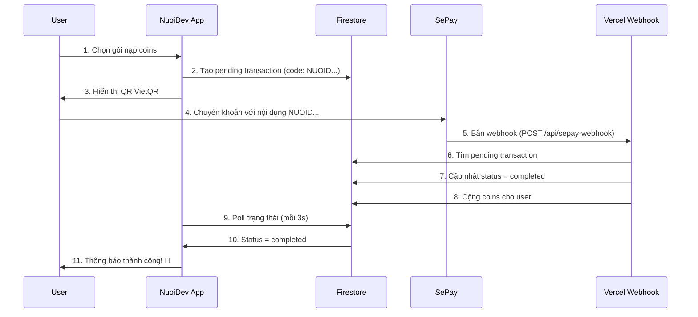
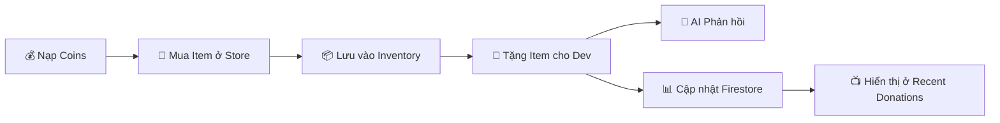

# 🎮 NuoiDev - Nuôi Dev Sống Sót

> Ứng dụng donation vui nhộn với AI Avatar và hệ thống thanh toán tự động qua SePay

**Live Demo:** https://nuoidev.web.app


## ✨ Tính năng

- 🤖 **AI Avatar 3D** - Nhân vật dev thông minh với Gemini AI
- 💬 **Chat với Dev** - Giao tiếp real-time với AI
- 🎁 **Hệ thống Item** - Mua & tặng items cho dev (kiểu TikTok)
- 💰 **Thanh toán tự động** - VietQR + SePay Webhook
- 📦 **Inventory System** - Kho đồ cá nhân
- 🔥 **Real-time Updates** - Firestore real-time

## 🏗️ Tech Stack

| Frontend | Backend | Payment |
|----------|---------|---------|
| React + TypeScript | Firebase Firestore | SePay Webhook |
| Vite | Firebase Hosting | VietQR |
| Three.js (3D Avatar) | Vercel Serverless | MB Bank |
| Framer Motion | Gemini AI | |
| TailwindCSS | | |

## 💳 Sơ đồ Thanh toán



## 🎯 Luồng Inventory & Donation



## 🚀 Cài đặt & Chạy

### 1. Clone repo

```bash
git clone https://github.com/VietPh37030/NuoiDeV.git
cd NuoiDeV
npm install
```

### 2. Cấu hình Firebase

Tạo file `.env` với nội dung:

```env
VITE_FIREBASE_API_KEY=your_api_key
VITE_FIREBASE_AUTH_DOMAIN=your_project.firebaseapp.com
VITE_FIREBASE_PROJECT_ID=your_project_id
```

### 3. Chạy development

```bash
npm run dev
```

### 4. Build & Deploy

```bash
npm run build
firebase deploy --only hosting
```

## 🔧 Cấu hình SePay Webhook

### Webhook URL
```
https://nuoidev-webhook.vercel.app/api/sepay-webhook
```

### Cấu hình trong SePay

| Trường | Giá trị |
|--------|---------|
| Bắn WebHooks khi | Có tiền vào |
| Tài khoản | MBBank - 0378117461 |
| Bỏ qua nếu không có Code | Có |
| Là WebHooks xác thực thanh toán | Đúng |
| Kiểu chứng thực | Không cần |
| Content-Type | application/json |

### Cấu trúc mã thanh toán

- **Tiền tố:** `NUOID`
- **Độ dài:** 3-15 ký tự
- **Kiểu:** Số nguyên

## 📁 Cấu trúc Project

```
NuoiDev/
├── src/
│   ├── components/       # React components
│   │   ├── IanAvatar.tsx      # 3D Avatar với Three.js
│   │   ├── DonateModal.tsx    # Modal tặng quà
│   │   └── TopUpModal.tsx     # Modal nạp tiền
│   ├── hooks/            # Custom hooks
│   │   ├── useInventory.ts    # Quản lý kho đồ
│   │   └── useRecentDonations.ts
│   ├── pages/            # Các trang
│   └── lib/              # Utils & configs
│       ├── gemini.ts          # Gemini AI integration
│       └── firebase.ts        # Firebase config
├── nuoidev-webhook/      # Vercel webhook (submodule)
│   └── api/
│       └── sepay-webhook.js
├── public/models/        # 3D models & animations
└── firebase.json         # Firebase config
```

## 🎮 Items trong Store

| Item | Giá | Emoji | Mô tả |
|------|-----|-------|-------|
| Sextoy | 1 coin | 🔞 | Quà 18+ cho dev (joke) |
| Mì Gói | 5 coins | 🍜 | Món ăn cứu đói |
| Trà Sữa | 15 coins | 🧋 | Năng lượng code |
| Card Game | 50 coins | 🎴 | Giải trí sau giờ code |
| Server | 100 coins | 💻 | Host project |
| Tiền Cho Gái | 200 coins | 💸 | Để dev có người yêu 😂 |

## 👨‍💻 Tác giả

**Phạm Việt Anh (Ian Phạm)**

- GitHub: [@VietPh37030](https://github.com/VietPh37030)
- Live App: https://nuoidev.web.app

## 📄 License

MIT License - Tự do sử dụng, donate cho dev nếu thấy hay! 💪
