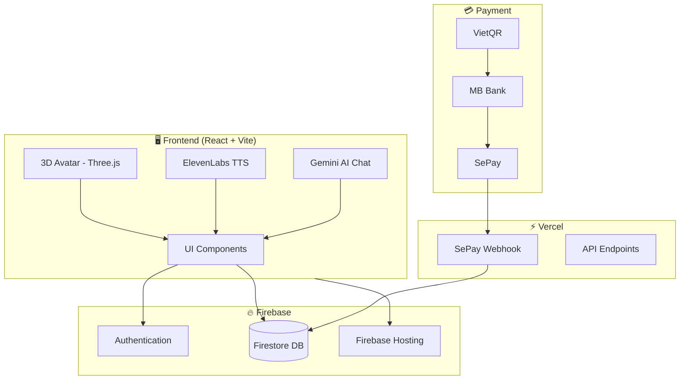
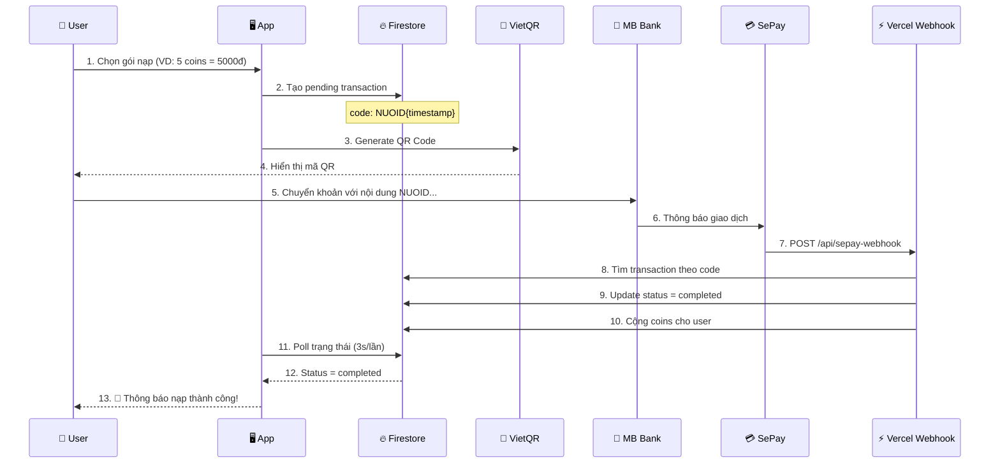
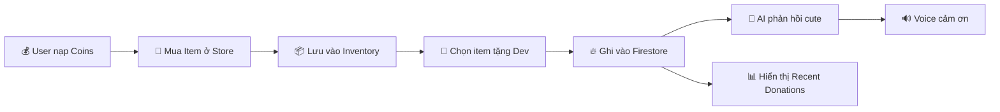

# 🎮 Hướng Dẫn Xây Dựng NuoiDev Từ Đầu

> Tutorial chi tiết từng bước để build ứng dụng donation với AI Avatar và thanh toán tự động

## 📋 Mục Lục

1. [Tổng Quan Dự Án](#tổng-quan-dự-án)
2. [Kiến Trúc Hệ Thống](#kiến-trúc-hệ-thống)
3. [Chuẩn Bị Môi Trường](#chuẩn-bị-môi-trường)
4. [Bước 1: Khởi Tạo Dự Án](#bước-1-khởi-tạo-dự-án)
5. [Bước 2: Cấu Hình Firebase](#bước-2-cấu-hình-firebase)
6. [Bước 3: Xây Dựng UI Components](#bước-3-xây-dựng-ui-components)
7. [Bước 4: Tích Hợp 3D Avatar](#bước-4-tích-hợp-3d-avatar)
8. [Bước 5: Tích Hợp Gemini AI](#bước-5-tích-hợp-gemini-ai)
9. [Bước 6: Hệ Thống Inventory](#bước-6-hệ-thống-inventory)
10. [Bước 7: Thanh Toán VietQR + SePay](#bước-7-thanh-toán-vietqr--sepay)
11. [Bước 8: ElevenLabs Text-to-Speech](#bước-8-elevenlabs-text-to-speech)
12. [Bước 9: Deploy](#bước-9-deploy)

---

## Tổng Quan Dự Án

**NuoiDev** là ứng dụng donation vui nhộn với:
- 🤖 AI Avatar 3D có thể chat
- 💬 Hội thoại thông minh với Gemini AI
- 🎁 Hệ thống mua/tặng quà kiểu TikTok
- 💰 Thanh toán tự động qua VietQR
- 🔊 Text-to-Speech tiếng Việt

---

## Kiến Trúc Hệ Thống

### Sơ Đồ Tổng Quan



### Luồng Thanh Toán Chi Tiết



### Luồng Inventory & Donation



---

## Chuẩn Bị Môi Trường

### Yêu Cầu

- Node.js >= 18.x
- npm hoặc yarn
- Git
- Tài khoản Firebase
- Tài khoản SePay (https://sepay.vn)
- API Key Gemini AI (https://aistudio.google.com)
- API Key ElevenLabs (https://elevenlabs.io)

### Công Cụ Khuyến Nghị

- VS Code với extensions: ESLint, Prettier, TypeScript
- Firebase CLI: `npm install -g firebase-tools`
- Vercel CLI: `npm install -g vercel`

---

## Bước 1: Khởi Tạo Dự Án

### 1.1 Tạo Vite React Project

```bash
# Tạo project với Vite + React + TypeScript
npm create vite@latest nuoidev -- --template react-ts
cd nuoidev

# Cài dependencies
npm install
```

### 1.2 Cài Đặt Dependencies

```bash
# UI & Animation
npm install framer-motion lucide-react

# 3D Graphics
npm install three @react-three/fiber @react-three/drei

# Firebase
npm install firebase

# Routing
npm install react-router-dom

# AI
npm install @google/genai
```

### 1.3 Cấu Trúc Thư Mục

```
nuoidev/
├── src/
│   ├── components/       # React components
│   │   ├── IanAvatar.tsx      # 3D Avatar
│   │   ├── DonateModal.tsx    # Modal tặng quà
│   │   ├── TopUpModal.tsx     # Modal nạp tiền
│   │   ├── ItemCard.tsx       # Card item
│   │   └── Navbar.tsx         # Navigation
│   ├── hooks/            # Custom hooks
│   │   ├── useAuth.tsx        # Authentication
│   │   ├── useInventory.ts    # Quản lý kho đồ
│   │   └── useRecentDonations.ts
│   ├── pages/            # Các trang
│   │   ├── Home.tsx
│   │   ├── Store.tsx
│   │   └── Wallet.tsx
│   ├── lib/              # Utils & configs
│   │   ├── firebase.ts        # Firebase config
│   │   ├── gemini.ts          # Gemini AI
│   │   ├── speech.ts          # ElevenLabs TTS
│   │   └── utils.ts           # Utilities
│   ├── App.tsx
│   ├── main.tsx
│   └── index.css
├── public/
│   └── models/           # 3D models (.glb)
├── nuoidev-webhook/      # Vercel webhook project
│   └── api/
│       ├── sepay-webhook.js
│       ├── create-transaction.js
│       └── check-payment.js
└── firebase.json
```

---

## Bước 2: Cấu Hình Firebase

### 2.1 Tạo Firebase Project

1. Vào https://console.firebase.google.com
2. Tạo project mới: `nuoidev`
3. Bật **Authentication** > Google Sign-In
4. Tạo **Firestore Database**
5. Bật **Firebase Hosting**

### 2.2 Lấy Firebase Config

```typescript
// src/lib/firebase.ts
import { initializeApp } from 'firebase/app'
import { getAuth, GoogleAuthProvider } from 'firebase/auth'
import { getFirestore } from 'firebase/firestore'

const firebaseConfig = {
    apiKey: "YOUR_API_KEY",
    authDomain: "nuoidev.firebaseapp.com",
    projectId: "nuoidev",
    storageBucket: "nuoidev.appspot.com",
    messagingSenderId: "123456789",
    appId: "YOUR_APP_ID"
}

const app = initializeApp(firebaseConfig)
export const auth = getAuth(app)
export const googleProvider = new GoogleAuthProvider()
export const db = getFirestore(app)
```

### 2.3 Firestore Rules

```javascript
// firestore.rules
rules_version = '2';
service cloud.firestore {
  match /databases/{database}/documents {
    // Users can read/write their own data
    match /users/{userId} {
      allow read, write: if request.auth.uid == userId;
    }
    
    // Inventories - user can only access their own
    match /inventories/{userId} {
      allow read, write: if request.auth.uid == userId;
    }
    
    // Public read for donations
    match /itemDonations/{docId} {
      allow read: if true;
      allow write: if request.auth != null;
    }
    
    // Dev status - public read
    match /devStatus/{docId} {
      allow read: if true;
      allow write: if true; // Webhook needs access
    }
    
    // Pending transactions
    match /pendingTransactions/{docId} {
      allow read, write: if true; // Webhook needs access
    }
  }
}
```

---

## Bước 3: Xây Dựng UI Components

### 3.1 Setup Tailwind CSS (tuỳ chọn)

```bash
npm install -D tailwindcss postcss autoprefixer
npx tailwindcss init -p
```

### 3.2 CSS Variables & Themes

```css
/* src/index.css */
:root {
    --primary: #10b981;
    --secondary: #8b5cf6;
    --background: #0a0a0f;
    --surface: #1a1a2e;
}

body {
    background: var(--background);
    color: white;
    font-family: 'Inter', sans-serif;
}

.glass {
    background: rgba(255, 255, 255, 0.05);
    backdrop-filter: blur(10px);
    border: 1px solid rgba(255, 255, 255, 0.1);
}

.gradient-text {
    background: linear-gradient(135deg, var(--primary), var(--secondary));
    -webkit-background-clip: text;
    -webkit-text-fill-color: transparent;
}

.btn-primary {
    background: linear-gradient(135deg, var(--primary), var(--secondary));
    padding: 0.75rem 1.5rem;
    border-radius: 0.75rem;
    font-weight: 600;
}
```

### 3.3 Items Configuration

```typescript
// src/lib/utils.ts
export interface Item {
    id: string
    name: string
    emoji: string
    price: number
    description: string
    category: 'food' | 'drink' | 'tech' | 'meme'
}

export const ITEMS: Item[] = [
    { id: 'sextoy', name: 'Sextoy', emoji: '🔞', price: 1, description: 'Quà 18+ cho dev...', category: 'meme' },
    { id: 'mi_goi', name: 'Mì Gói', emoji: '🍜', price: 5, description: 'Món ăn cứu đói', category: 'food' },
    { id: 'tra_sua', name: 'Trà Sữa', emoji: '🧋', price: 15, description: 'Năng lượng code', category: 'drink' },
    { id: 'card_game', name: 'Card Game', emoji: '🎴', price: 50, description: 'Giải trí', category: 'meme' },
    { id: 'server', name: 'Server', emoji: '💻', price: 100, description: 'Host project', category: 'tech' },
    { id: 'tien_gai', name: 'Tiền Cho Gái', emoji: '💸', price: 200, description: 'Để dev có ny', category: 'meme' },
]

export const TOP_UP_OPTIONS = [
    { coins: 1, price: 1000, label: '1 Coin' },
    { coins: 5, price: 5000, label: '5 Coins' },
    { coins: 10, price: 10000, label: '10 Coins' },
]
```

---

## Bước 4: Tích Hợp 3D Avatar

### 4.1 Chuẩn Bị 3D Model

1. Tạo avatar tại https://readyplayer.me
2. Download file `.glb`
3. Đặt vào `public/models/ian.glb`

### 4.2 Component IanAvatar

```tsx
// src/components/IanAvatar.tsx
import { useRef } from 'react'
import { Canvas, useFrame } from '@react-three/fiber'
import { useGLTF, OrbitControls, Environment } from '@react-three/drei'
import * as THREE from 'three'

function AvatarModel({ emotion }: { emotion: string }) {
    const group = useRef<THREE.Group>(null)
    const { scene } = useGLTF('/models/ian.glb')

    useFrame((state) => {
        if (!group.current) return
        const time = state.clock.elapsedTime

        // Animation based on emotion
        switch (emotion) {
            case 'happy':
            case 'excited':
                group.current.position.y = Math.sin(time * 3) * 0.03
                group.current.rotation.y = Math.sin(time * 2) * 0.15
                break
            case 'hungry':
                group.current.position.y = Math.sin(time * 0.8) * 0.02 - 0.05
                break
            default:
                group.current.position.y = Math.sin(time * 1.2) * 0.015
        }
    })

    return (
        <group ref={group}>
            <primitive object={scene} scale={1.5} position={[0, -1, 0]} />
        </group>
    )
}

export default function IanAvatar({ emotion, dialogue }: Props) {
    return (
        <div className="relative h-[400px]">
            <Canvas camera={{ position: [0, 0, 3], fov: 50 }}>
                <ambientLight intensity={0.5} />
                <directionalLight position={[5, 5, 5]} />
                <AvatarModel emotion={emotion} />
                <OrbitControls enableZoom={false} />
                <Environment preset="city" />
            </Canvas>
            
            {/* Dialogue bubble */}
            {dialogue && (
                <div className="absolute bottom-4 left-1/2 -translate-x-1/2 glass p-4 rounded-xl max-w-md">
                    {dialogue}
                </div>
            )}
        </div>
    )
}
```

---

## Bước 5: Tích Hợp Gemini AI

### 5.1 Lấy API Key

1. Vào https://aistudio.google.com/app/apikey
2. Tạo API key mới
3. Lưu vào code (hoặc `.env`)

### 5.2 Gemini Service

```typescript
// src/lib/gemini.ts
import { GoogleGenAI } from '@google/genai'

const GEMINI_API_KEY = 'YOUR_GEMINI_API_KEY'
const ai = new GoogleGenAI({ apiKey: GEMINI_API_KEY })

const SYSTEM_PROMPT = `Bạn là Ian Phạm, một developer Việt Nam vui tính.
Phong cách nói chuyện:
- Vui vẻ, gần gũi, dùng tiếng Việt có xen tiếng lóng
- Thỉnh thoảng nói đùa về việc dev nghèo
- Trả lời ngắn gọn (1-2 câu), dễ thương
- Dùng emoji thường xuyên`

export async function generateIanResponse(userMessage: string, context: any) {
    try {
        const response = await ai.models.generateContent({
            model: 'gemini-2.5-flash',
            contents: `${SYSTEM_PROMPT}\n\nNgười dùng nói: ${userMessage}`,
        })
        return {
            text: response.text || 'Dev bị lag...',
            emotion: detectEmotion(response.text)
        }
    } catch (error) {
        return getSmartFallback(userMessage)
    }
}

// Quick responses for common events
export function getQuickResponse(event: string, userName?: string) {
    const responses = {
        donate: [
            { text: `Cảm ơn ${userName} nhiều! Iêu bạn quá trời!`, emotion: 'excited' },
            { text: `Waaaa! Dễ thương quá, iêu iêu bạn!`, emotion: 'happy' },
        ],
        // ... more responses
    }
    return responses[event][Math.floor(Math.random() * responses[event].length)]
}
```

---

## Bước 6: Hệ Thống Inventory

### 6.1 useInventory Hook

```typescript
// src/hooks/useInventory.ts
import { useState, useEffect } from 'react'
import { doc, onSnapshot, updateDoc, setDoc, getDoc } from 'firebase/firestore'
import { db } from '@/lib/firebase'
import { useAuth } from './useAuth'

export function useInventory() {
    const { user } = useAuth()
    const [inventory, setInventory] = useState([])

    useEffect(() => {
        if (!user) return

        const unsubscribe = onSnapshot(
            doc(db, 'inventories', user.uid),
            (snapshot) => {
                setInventory(snapshot.data()?.items || [])
            }
        )

        return () => unsubscribe()
    }, [user])

    const addItem = async (itemId: string, quantity: number = 1) => {
        // Add item to inventory in Firestore
    }

    const removeItem = async (itemId: string, quantity: number = 1) => {
        // Remove item from inventory
    }

    return { inventory, addItem, removeItem }
}
```

### 6.2 Store Page - Mua Item Vào Inventory

```tsx
// src/pages/Store.tsx
const handlePurchase = async (itemId: string) => {
    // 1. Trừ coins từ user
    await updateDoc(doc(db, 'users', user.uid), {
        coins: increment(-item.price)
    })

    // 2. Thêm vào inventory (KHÔNG donate trực tiếp)
    await addItem(itemId, 1)

    // 3. Ghi log purchase
    await addDoc(collection(db, 'purchases'), { ... })
}
```

### 6.3 DonateModal - Tặng Item Từ Inventory

```tsx
// src/components/DonateModal.tsx
const handleDonate = async (item) => {
    // 1. Remove from inventory
    await removeItem(item.id, 1)

    // 2. Record donation
    await addDoc(collection(db, 'itemDonations'), {
        userName: userData.displayName,
        itemName: item.name,
        itemEmoji: item.emoji,
        coinAmount: item.price,
        createdAt: serverTimestamp()
    })

    // 3. Update dev status
    await updateDoc(doc(db, 'devStatus', 'current'), {
        totalCoins: increment(item.price),
        totalDonations: increment(1)
    })

    // 4. Get AI response & speak
    const response = getQuickResponse('donate', userName)
    onDonate(response)
}
```

---

## Bước 7: Thanh Toán VietQR + SePay

### 7.1 Cấu Hình SePay

1. Đăng ký tại https://sepay.vn
2. Liên kết tài khoản ngân hàng (VD: MB Bank)
3. Cấu hình Webhook:
   - URL: `https://your-vercel-app.vercel.app/api/sepay-webhook`
   - Event: `Có tiền vào`
   - Content-Type: `application/json`
4. Cấu hình mã thanh toán:
   - Prefix: `NUOID`
   - Độ dài: 3-15 ký tự

### 7.2 TopUpModal - Hiển Thị QR

```tsx
// src/components/TopUpModal.tsx
const BANK_ID = '970422' // MB Bank
const ACCOUNT_NO = '0378117461'
const ACCOUNT_NAME = 'PHAM VIET ANH'

const TopUpModal = ({ selectedOption }) => {
    const paymentCode = `NUOID${Date.now()}`
    
    const vietQrUrl = `https://img.vietqr.io/image/${BANK_ID}-${ACCOUNT_NO}-compact.jpg?amount=${selectedOption.price}&addInfo=${paymentCode}&accountName=${encodeURIComponent(ACCOUNT_NAME)}`

    // Create pending transaction
    useEffect(() => {
        createPendingTransaction(paymentCode, selectedOption)
    }, [])

    // Poll for payment status
    useEffect(() => {
        const interval = setInterval(async () => {
            const status = await checkPaymentStatus(paymentCode)
            if (status === 'completed') {
                setSuccess(true)
                clearInterval(interval)
            }
        }, 3000)
        return () => clearInterval(interval)
    }, [paymentCode])

    return (
        <div>
            
            <p>Nội dung CK: {paymentCode}</p>
        </div>
    )
}
```

### 7.3 Vercel Webhook

```javascript
// nuoidev-webhook/api/sepay-webhook.js
const admin = require('firebase-admin')

// Initialize Firebase Admin
if (!admin.apps.length) {
    const serviceAccount = JSON.parse(process.env.FIREBASE_SERVICE_ACCOUNT)
    admin.initializeApp({
        credential: admin.credential.cert(serviceAccount)
    })
}

const db = admin.firestore()

module.exports = async (req, res) => {
    // CORS
    res.setHeader('Access-Control-Allow-Origin', '*')
    
    if (req.method !== 'POST') {
        return res.status(405).json({ error: 'Method not allowed' })
    }

    const { transferAmount, content } = req.body

    // Extract payment code from content
    const match = content.match(/NUOID\d+/)
    if (!match) {
        return res.status(400).json({ error: 'Invalid payment code' })
    }

    const paymentCode = match[0]

    // Find pending transaction
    const snapshot = await db.collection('pendingTransactions')
        .where('paymentCode', '==', paymentCode)
        .where('status', '==', 'pending')
        .get()

    if (snapshot.empty) {
        return res.status(404).json({ error: 'Transaction not found' })
    }

    const transaction = snapshot.docs[0]
    const data = transaction.data()

    // Update transaction status
    await transaction.ref.update({
        status: 'completed',
        actualAmount: transferAmount,
        completedAt: admin.firestore.FieldValue.serverTimestamp()
    })

    // Credit coins to user
    await db.collection('users').doc(data.userId).update({
        coins: admin.firestore.FieldValue.increment(data.coins)
    })

    return res.status(200).json({ success: true })
}
```

### 7.4 Deploy Webhook lên Vercel

```bash
cd nuoidev-webhook
npm init -y
npm install firebase-admin

# Push to GitHub
git init
git add .
git commit -m "SePay webhook"
git remote add origin https://github.com/username/nuoidev-webhook.git
git push -u origin main

# Connect to Vercel
# 1. Vào vercel.com
# 2. Import GitHub repo
# 3. Set Environment Variable: FIREBASE_SERVICE_ACCOUNT
```

---

## Bước 8: ElevenLabs Text-to-Speech

### 8.1 Lấy API Key & Voice ID

1. Đăng ký tại https://elevenlabs.io
2. Vào Settings > API Keys > Tạo key mới
3. Vào Voices > Chọn voice tiếng Việt > Copy Voice ID

### 8.2 Speech Service

```typescript
// src/lib/speech.ts
const ELEVENLABS_API_KEY = 'YOUR_API_KEY'
const VIETNAMESE_VOICE_ID = 'LPldyaIkUUSOPCRFrgYJ' // Hùng voice

class ElevenLabsTTS {
    private currentAudio: HTMLAudioElement | null = null

    async speak(text: string) {
        this.stop()

        const cleanText = text.replace(/[\u{1F600}-\u{1F9FF}]/gu, '') // Remove emoji

        const response = await fetch(
            `https://api.elevenlabs.io/v1/text-to-speech/${VIETNAMESE_VOICE_ID}`,
            {
                method: 'POST',
                headers: {
                    'Accept': 'audio/mpeg',
                    'Content-Type': 'application/json',
                    'xi-api-key': ELEVENLABS_API_KEY
                },
                body: JSON.stringify({
                    text: cleanText,
                    model_id: 'eleven_turbo_v2_5',
                    language_code: 'vi',
                    voice_settings: {
                        stability: 0.6,
                        similarity_boost: 0.8
                    }
                })
            }
        )

        const audioBlob = await response.blob()
        const audioUrl = URL.createObjectURL(audioBlob)
        
        this.currentAudio = new Audio(audioUrl)
        await this.currentAudio.play()
    }

    stop() {
        if (this.currentAudio) {
            this.currentAudio.pause()
            this.currentAudio = null
        }
    }
}

export const tts = new ElevenLabsTTS()
export const speak = (text: string) => tts.speak(text)
export const stopSpeaking = () => tts.stop()
```

### 8.3 Tích Hợp Vào Home

```tsx
// src/pages/Home.tsx
import { speak, stopSpeaking } from '@/lib/speech'

// Auto-speak when dialogue changes
useEffect(() => {
    if (dialogue && voiceEnabled && !isThinking) {
        speak(dialogue)
    }
    return () => stopSpeaking()
}, [dialogue, voiceEnabled])

// Handle donation response with voice
const handleDonateResponse = (response) => {
    setDialogue(response.text)
    setAvatarEmotion(response.emotion)
    if (voiceEnabled) {
        speak(response.text)
    }
}
```

---

## Bước 9: Deploy

### 9.1 Build Production

```bash
npm run build
```

### 9.2 Deploy Firebase Hosting

```bash
# Login Firebase
firebase login

# Initialize (chọn Hosting)
firebase init hosting

# Deploy
firebase deploy --only hosting
```

### 9.3 Cấu Hình firebase.json

```json
{
  "hosting": {
    "public": "dist",
    "ignore": ["firebase.json", "**/.*", "**/node_modules/**"],
    "rewrites": [
      { "source": "**", "destination": "/index.html" }
    ]
  }
}
```

### 9.4 Kết Quả

- **Live App**: https://nuoidev.web.app
- **Webhook**: https://nuoidev-webhook.vercel.app

---

## 🎉 Hoàn Thành!

Bạn đã build xong **NuoiDev** với đầy đủ tính năng:

- ✅ 3D Avatar với animation
- ✅ Gemini AI chat
- ✅ ElevenLabs TTS tiếng Việt
- ✅ Inventory system
- ✅ Tặng quà kiểu TikTok
- ✅ VietQR thanh toán tự động
- ✅ Real-time donations

---

## 📚 Tài Liệu Tham Khảo

- [Vite Documentation](https://vitejs.dev)
- [React Three Fiber](https://docs.pmnd.rs/react-three-fiber)
- [Firebase Documentation](https://firebase.google.com/docs)
- [Gemini AI API](https://ai.google.dev/docs)
- [ElevenLabs API](https://elevenlabs.io/docs)
- [VietQR Hướng Dẫn](https://vietqr.net/docs)
- [SePay Webhook](https://docs.sepay.vn)

---

**Author**: Phạm Việt Anh (Ian Phạm)  
**GitHub**: https://github.com/VietPh37030/NuoiDeV
